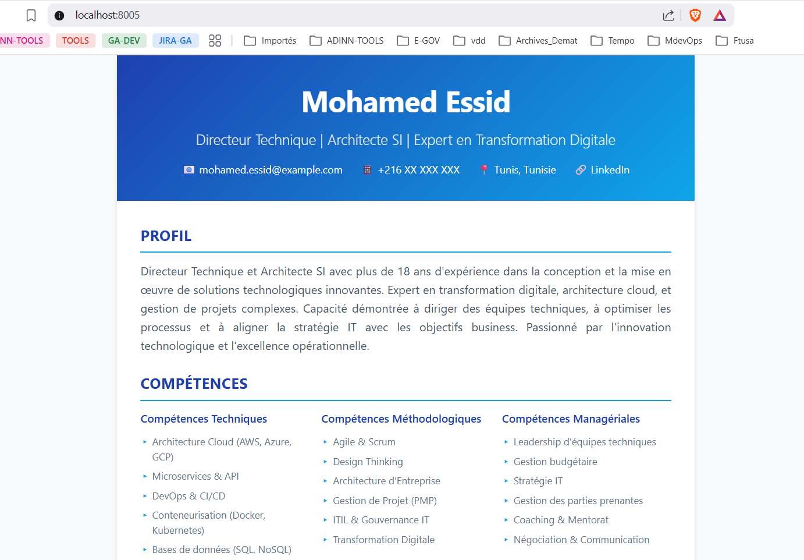

# TP CI/CD - Partie 1 : Déploiement d'un CV One-Page

## 📋 Description du Projet

Ce projet consiste à créer un CV One-Page en HTML5/CSS3, le conteneuriser avec Docker, et le déployer en utilisant les bonnes pratiques CI/CD et Git.

**Auteur**: Mohamed Essid  
**Date**: Novembre 2025  
**Contexte**: Master DevOps 2025

---

## 🎯 Objectifs du TP

- ✅ Créer un CV One-Page HTML5/CSS3
- ✅ Mettre en place un système de versioning avec Git
- ✅ Déployer sur GitHub Pages
- ✅ Conteneuriser l'application avec Docker
- ✅ Publier l'image sur Docker Hub
- ✅ Déployer localement avec Docker Compose

---

## 📁 Structure du Projet

```
.
├── cv-mohamed-essid.html    # CV One-Page HTML5/CSS3
├── Dockerfile               # Fichier de configuration Docker
├── docker-compose.yml       # Configuration Docker Compose
├── .gitignore              # Fichiers à ignorer par Git
└── README.md               # Documentation du projet
```

---

## 🚀 Étape 1 : Création du CV One-Page

### Description
Création d'un CV professionnel en HTML5/CSS3 avec un design moderne et responsive.

### Caractéristiques du CV
- Design moderne avec dégradé bleu
- Sections : Profil, Compétences, Expérience, Formation, Projets
- Responsive (adaptatif mobile/desktop)
- Optimisé pour l'impression
- CSS intégré dans le fichier HTML

### Capture d'écran


---

## 🔧 Étape 2 : Initialisation du Dépôt Git

### Commandes exécutées

```powershell
# Initialisation du dépôt Git
git init

# Ajout du fichier .gitignore
git add .gitignore

# Ajout du CV
git add cv-mohamed-essid.html

# Premier commit
git commit -m "Version 1"
```

### Vérification

```powershell
# Vérifier le statut
git status

# Afficher l'historique
git log --oneline
```

### Capture d'écran


---

## 🌿 Étape 3 : Création de la Branche Dev

### Commandes exécutées

```powershell
# Création et basculement sur la branche dev
git checkout -b dev

# Vérifier les branches
git branch
```

### Résultat attendu
```
* dev
  main
```

### Capture d'écran


---

## 🌐 Étape 4 : Déploiement sur GitHub Pages

### Prérequis
- Compte GitHub créé
- Repository nommé `USERNAME.github.io` (remplacer USERNAME par votre nom d'utilisateur)

### Commandes exécutées

```powershell
# Créer le repository sur GitHub (via l'interface web)
# Nom : USERNAME.github.io

# Ajouter le remote
git remote add origin https://github.com/USERNAME/USERNAME.github.io.git

# Renommer la branche principale en main (si nécessaire)
git branch -M main

# Pousser la branche main
git push -u origin main

# Pousser la branche dev
git push -u origin dev
```

### Configuration GitHub Pages

1. Aller dans **Settings** > **Pages**
2. Source : **Deploy from a branch**
3. Branch : **main** / **(root)**
4. Cliquer sur **Save**

### Vérification
Accéder à : `https://USERNAME.github.io/cv-mohamed-essid.html`

### Capture d'écran


---

## 🐳 Étape 5 : Création du Dockerfile

### Contenu du Dockerfile

```dockerfile
# Utilisation de l'image nginx alpine (légère)
FROM nginx:alpine

# Copie du CV HTML dans le répertoire par défaut de nginx
COPY cv-mohamed-essid.html /usr/share/nginx/html/index.html

# Exposition du port 80
EXPOSE 80

# Nginx démarre automatiquement avec l'image
CMD ["nginx", "-g", "daemon off;"]
```

### Explication
- **FROM nginx:alpine** : Utilise une image nginx légère basée sur Alpine Linux
- **COPY** : Copie le CV dans le répertoire web de nginx
- **EXPOSE 80** : Documente que le conteneur écoute sur le port 80
- **CMD** : Commande de démarrage de nginx en mode foreground

### Capture d'écran


---

## 🏗️ Étape 6 : Création de l'Image Docker

### Commandes exécutées

```powershell
# Construction de l'image
docker build -t cv-mohamed-essid .

# Vérifier que l'image est créée
docker images | Select-String "cv-mohamed-essid"
```

### Résultat attendu
```
cv-mohamed-essid    latest    abc123def456    10 seconds ago    23.5MB
```

### Test de l'image
```powershell
# Lancer un conteneur de test
docker run -d -p 8080:80 --name cv-test cv-mohamed-essid

# Tester dans le navigateur
# Accéder à : http://localhost:8080

# Arrêter et supprimer le conteneur de test
docker stop cv-test
docker rm cv-test
```

### Capture d'écran


---

## 🏷️ Étape 7 : Tag de l'Image Docker

### Commandes exécutées

```powershell
# Créer un tag avec votre username Docker Hub
docker tag cv-mohamed-essid VOTRE_DOCKERHUB_USERNAME/cv:v1

# Vérifier les images
docker images | Select-String "cv"
```

### Résultat attendu
```
cv-mohamed-essid                        latest    abc123def456    5 minutes ago    23.5MB
VOTRE_DOCKERHUB_USERNAME/cv            v1        abc123def456    5 minutes ago    23.5MB
```

### Capture d'écran


---

## 📤 Étape 8 : Publication sur Docker Hub

### Prérequis
- Compte Docker Hub créé sur https://hub.docker.com

### Commandes exécutées

```powershell
# Connexion à Docker Hub
docker login
# Entrer votre username et password

# Pousser l'image sur Docker Hub
docker push VOTRE_DOCKERHUB_USERNAME/cv:v1
```

### Vérification
- Aller sur https://hub.docker.com
- Vérifier que l'image `cv:v1` est présente dans vos repositories

### Capture d'écran


---

## 📦 Étape 9 : Création du Docker Compose

### Contenu du docker-compose.yml

```yaml
version: '3.8'

services:
  cv-web:
    image: ${DOCKER_USERNAME}/cv:v1
    container_name: cv-mohamed-essid
    ports:
      - "8005:80"
    restart: unless-stopped
    labels:
      description: "CV One-Page de Mohamed Essid"
      version: "1.0"
```

### Explication
- **version: '3.8'** : Version de Docker Compose
- **services** : Définition des services
- **image** : Image à utiliser (depuis Docker Hub)
- **container_name** : Nom du conteneur
- **ports** : Mapping de ports (8005:80)
- **restart** : Politique de redémarrage
- **labels** : Métadonnées

### Capture d'écran


---

## 🚢 Étape 10 : Déploiement avec Docker Compose

### Configuration de la variable d'environnement

```powershell
# Définir la variable d'environnement (PowerShell)
$env:DOCKER_USERNAME="VOTRE_DOCKERHUB_USERNAME"

# Ou créer un fichier .env
echo "DOCKER_USERNAME=VOTRE_DOCKERHUB_USERNAME" > .env
```

### Commandes de déploiement

```powershell
# Lancer le stack Docker Compose
docker-compose up -d

# Vérifier que le conteneur est en cours d'exécution
docker-compose ps

# Voir les logs
docker-compose logs -f
```

### Résultat attendu
```
Name                  Command              State           Ports
-------------------------------------------------------------------------
cv-mohamed-essid   /docker-entrypoint.sh ...   Up      0.0.0.0:8005->80/tcp
```

### Capture d'écran


---

## 🌐 Étape 11 : Test de l'Application

### Accès à l'application

Ouvrir un navigateur et accéder à : **http://localhost:8005**

### Vérifications à effectuer
- ✅ Le CV s'affiche correctement
- ✅ Le design est responsive
- ✅ Toutes les sections sont présentes
- ✅ Les styles CSS sont appliqués

### Commandes de vérification

```powershell
# Vérifier que le port 8005 est bien écouté
netstat -an | Select-String "8005"

# Tester avec curl
curl http://localhost:8005
```

### Capture d'écran


---

## 🛠️ Commandes Utiles

### Git

```powershell
# Afficher le statut
git status

# Afficher l'historique
git log --oneline --graph --all

# Changer de branche
git checkout main
git checkout dev

# Pousser les modifications
git push origin main
git push origin dev
```

### Docker

```powershell
# Lister les images
docker images

# Lister les conteneurs en cours d'exécution
docker ps

# Arrêter le conteneur
docker-compose down

# Redémarrer le conteneur
docker-compose restart

# Supprimer l'image
docker rmi VOTRE_DOCKERHUB_USERNAME/cv:v1

# Nettoyer les ressources inutilisées
docker system prune -a
```

---

## 📊 Architecture du Projet

```
┌─────────────────────────────────────────────────────────┐
│                   DÉVELOPPEMENT                          │
│  ┌─────────────────────────────────────────────────┐   │
│  │  Git Repository (Local)                         │   │
│  │  ├── main branch                                │   │
│  │  └── dev branch                                 │   │
│  └─────────────────────────────────────────────────┘   │
└─────────────────────────────────────────────────────────┘
                         │
                         ▼
┌─────────────────────────────────────────────────────────┐
│                   VERSIONNING                            │
│  ┌─────────────────────────────────────────────────┐   │
│  │  GitHub Repository                              │   │
│  │  ├── main branch                                │   │
│  │  ├── dev branch                                 │   │
│  │  └── GitHub Pages (USERNAME.github.io)         │   │
│  └─────────────────────────────────────────────────┘   │
└─────────────────────────────────────────────────────────┘
                         │
                         ▼
┌─────────────────────────────────────────────────────────┐
│                 CONTENEURISATION                         │
│  ┌─────────────────────────────────────────────────┐   │
│  │  Dockerfile                                     │   │
│  │  └── nginx:alpine + cv-mohamed-essid.html      │   │
│  └─────────────────────────────────────────────────┘   │
│                         │                               │
│                         ▼                               │
│  ┌─────────────────────────────────────────────────┐   │
│  │  Docker Image                                   │   │
│  │  └── USERNAME/cv:v1                             │   │
│  └─────────────────────────────────────────────────┘   │
└─────────────────────────────────────────────────────────┘
                         │
                         ▼
┌─────────────────────────────────────────────────────────┐
│                   REGISTRE                               │
│  ┌─────────────────────────────────────────────────┐   │
│  │  Docker Hub                                     │   │
│  │  └── USERNAME/cv:v1                             │   │
│  └─────────────────────────────────────────────────┘   │
└─────────────────────────────────────────────────────────┘
                         │
                         ▼
┌─────────────────────────────────────────────────────────┐
│                   DÉPLOIEMENT                            │
│  ┌─────────────────────────────────────────────────┐   │
│  │  Docker Compose                                 │   │
│  │  └── Port 8005 → Container Port 80              │   │
│  └─────────────────────────────────────────────────┘   │
│                         │                               │
│                         ▼                               │
│  ┌─────────────────────────────────────────────────┐   │
│  │  Navigateur                                     │   │
│  │  └── http://localhost:8005                      │   │
│  └─────────────────────────────────────────────────┘   │
└─────────────────────────────────────────────────────────┘
```

---

## 📝 Notes Importantes

### Variables à remplacer
- **USERNAME** : Votre nom d'utilisateur GitHub
- **VOTRE_DOCKERHUB_USERNAME** : Votre nom d'utilisateur Docker Hub

### Bonnes pratiques appliquées
- ✅ Utilisation de `.gitignore` pour exclure les fichiers système
- ✅ Messages de commit descriptifs
- ✅ Utilisation de branches (main et dev)
- ✅ Image Docker légère (Alpine Linux)
- ✅ Variables d'environnement pour Docker Compose
- ✅ Documentation complète

### Sécurité
- Ne jamais commiter de credentials ou tokens dans Git
- Utiliser des variables d'environnement pour les informations sensibles
- Garder les images Docker à jour

---

## 🎓 Compétences Acquises

- ✅ Création de pages web HTML5/CSS3
- ✅ Gestion de versions avec Git
- ✅ Utilisation de GitHub et GitHub Pages
- ✅ Conteneurisation avec Docker
- ✅ Orchestration avec Docker Compose
- ✅ Publication d'images sur Docker Hub
- ✅ Déploiement d'applications web
- ✅ Documentation technique

---

## 🔗 Liens Utiles

- [Documentation Git](https://git-scm.com/doc)
- [GitHub Pages](https://pages.github.com/)
- [Docker Documentation](https://docs.docker.com/)
- [Docker Compose](https://docs.docker.com/compose/)
- [Docker Hub](https://hub.docker.com/)
- [Nginx Documentation](https://nginx.org/en/docs/)

---

## 📧 Contact

**Mohamed Essid**  
Email: mohamed.essid@example.com  
LinkedIn: [Profil LinkedIn](#)  
GitHub: [USERNAME](https://github.com/USERNAME)

---

## 📄 Licence

Ce projet est réalisé dans le cadre d'un TP académique - Master DevOps 2025

---

**Date de dernière mise à jour**: Novembre 2025
